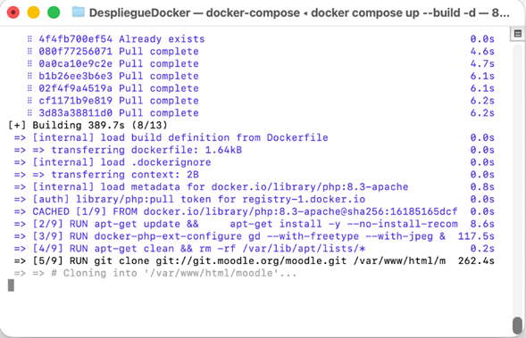
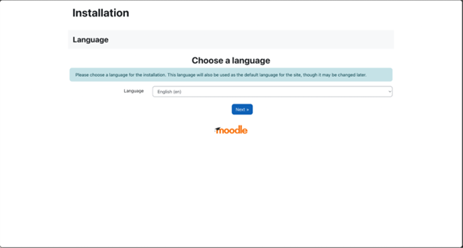

#Como correr el docker-compose en la maquina MAC 

 Chin Cervera Carlos Guillermo, Nuñez Che Rafael Abisai, Lozano Contreras Luis Enrique
**Práctica:** Despliegue de un Sistema LMS Moodle con GitHub/Docker en una Mac Pro 2019

Crea un archivo nuevo, pega este código y guárdalo exactamente con el nombre docker-compose.yml. Este archivo es el que se encarga de crear y levantar el Moodle y su base de datos.

```
services:
  # Servicio de Moodle (Tu App) [cite: 200]
  moodleapp:
    build:
      context: .
    image: moodleapp:1.0
    container_name: moodleapp
    ports:
      - "80:80"
    volumes:
      - moodledata:/var/www/moodledata
    depends_on:
      - moodledb

  # Servicio de Base de Datos MySQL [cite: 215-216]
  moodledb:
    image: mysql:8.0.36
    container_name: clouddb
    environment:
      MYSQL_ROOT_PASSWORD: ${MYSQL_ROOT_PASSWORD}
      MYSQL_DATABASE: ${MYSQL_DATABASE}
      MYSQL_USER: ${MYSQL_USER}
      MYSQL_PASSWORD: ${MYSQL_PASSWORD}
    volumes:
      - clouddbdata:/var/lib/mysql

  # phpMyAdmin para gestionar la DB [cite: 226-227]
  phpmyadmin:
    image: phpmyadmin
    container_name: phpmyadmin
    restart: always
    ports:
      - "8081:80"
    environment:
      PMA_HOST: clouddb
      PMA_PORT: 3306
      PMA_USER: ${MYSQL_USER}
      PMA_PASSWORD: ${MYSQL_PASSWORD}
    depends_on:
      - moodledb

volumes:
  clouddbdata:
  moodledata:
```

Luego creamos el archivo Dockerfile:

```
# Usa la imagen oficial de PHP 8.3 con Apache [cite: 156]
FROM php:8.3-apache

# Instala paquetes y extensiones necesarias [cite: 157-159]
RUN apt-get update && \
    apt-get install -y --no-install-recommends unzip git curl libzip-dev libjpeg-dev libpng-dev libfreetype6-dev libicu-dev libxml2-dev libpng-dev libpq-dev libxml2-dev zlib1g-dev libicu-dev g++

# Configura e instala extensiones de PHP requeridas por Moodle [cite: 160-163]
RUN docker-php-ext-configure gd --with-freetype --with-jpeg && \
    docker-php-ext-install mysqli zip gd intl soap exif opcache && \
    docker-php-ext-enable mysqli zip gd intl soap exif opcache

# Limpieza para reducir el tamaño de la imagen [cite: 164-165]
RUN apt-get clean && rm -rf /var/lib/apt/lists/*

# Clona el repositorio de Moodle (Versión 4.5 estable) [cite: 166, 174-177]
RUN git clone git://git.moodle.org/moodle.git /var/www/html/moodle && \
    cd /var/www/html/moodle && \
    git checkout MOODLE_405_STABLE && \
    cp -rf ./* /var/www/html/ && \
    rm -rf /var/www/html/moodle

# Configuraciones de PHP para Moodle [cite: 179-181]
RUN echo "max_input_vars=5000" >> /usr/local/etc/php/conf.d/docker-php-moodle.ini && \
    echo "opcache.enable=1" >> /usr/local/etc/php/conf.d/docker-php-moodle.ini

# Crea el directorio para los datos de Moodle [cite: 182-183]
RUN mkdir -p /var/www/moodledata

# Define el directorio de trabajo y permisos [cite: 184-188]
WORKDIR /var/www/html
RUN chown -R www-data:www-data /var/www/ && \
    chmod -R 755 /var/www

# Expone el puerto 80 [cite: 189-190]
EXPOSE 80

```
Creamos el archivo .env

```
MYSQL_ROOT_PASSWORD=mysql-rootpass
MYSQL_DATABASE=moodlelms
MYSQL_USER=moodle-admin
MYSQL_PASSWORD=moodle-dbpass

```

 1. Para ejecutar este contenedor en la Mac Pro del laboratorio, sigue estos comandos en la terminal:

  git clone [https://github.com/Solomemo09/DespliegueDocker.git](https://github.com/Solomemo09/DespliegueDocker.git)
   cd DespliegueDocker


   

(Antes de levantar el Docker compose debemos modificar el archivo .env.txt con el siguiente comando:
```
sudo mv .env.txt .env
```

2. Levantar el Moodle con Docker Compose:

   sudo docker compose up --build -d
   



   
   

4. Acceder a la plataforma:
   Abre el navegador web e ingresa a http://localhost:8080


   

6. Instrucciones básicas para crear un curso en Moodle
Una vez que el sistema esté corriendo y hayas iniciado sesión con las credenciales de administrador, sigue estos pasos:

Ve al menú lateral y selecciona "Administración del sitio".

Haz clic en la pestaña "Cursos" y luego en "Administrar cursos y categorías".

Presiona el botón que dice "Crear nuevo curso".

Llena los campos obligatorios:

Nombre completo del curso (ej. "Introducción a la Ciberseguridad").

Nombre corto del curso.

Desplázate hasta el final de la página y haz clic en "Guardar cambios y mostrar".


  
